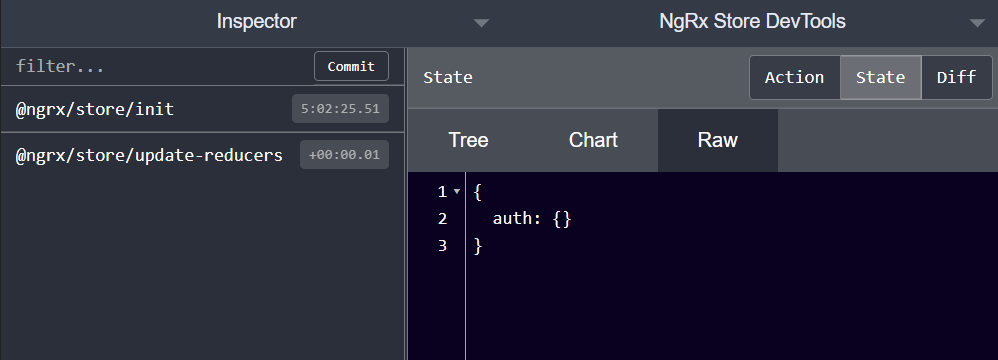

# NgRx (with NgRx Data) - The Complete Guide

June 2021

> 🔨 From udemy: [NgRx (with NgRx Data) - The Complete Guide - Vasco Cavalheiro / Angular University](https://www.udemy.com/course/ngrx-course/).

---


ReactiveX is a library for composing asynchronous and event-based programs by using observable sequences.

It extends the observer pattern to support sequences of data and/or events and adds operators that allow you to compose sequences together declaratively while abstracting away concerns about things like low-level threading, synchronization, thread-safety, concurrent data structures, and non-blocking I/O.

## To Run the Development Backend Server

We can start the sample application backend with the following command:

    `npm run server`

This is a small Node REST API server.

## To run the Development UI Server

To run the frontend part of our code, we will use the Angular CLI:

    `npm start`

The application is visible at port 4200: [http://localhost:4200](http://localhost:4200)

## Generate store for aspecific module

`ng generate store auth/Auth --module auth.module.ts`

```batch
CREATE src/app/auth/reducers/index.ts (359 bytes)
UPDATE src/app/auth/auth.module.ts (1221 bytes)
```

_src/app/auth/auth.module.ts_

```ts
@NgModule({
  imports: [
    // ...
    StoreModule.forFeature("auth", fromAuth.reducers),
  ],
```



## Dependancies

- [NgRx Store](https://ngrx.io/guide/store/why): NgRx Store provides state management for creating maintainable, explicit applications through the use of single state and actions in order to express state changes. In cases where you don't need a global, application-wide solution to manage state, consider using NgRx ComponentStore which provides a solution for local state management.

`ng add @ngrx/store`

`ng add @ngrx/store-devtools`

## Concepts

### Pipes

Use pipes to transform strings, currency amounts, dates, and other data for display. Pipes are simple functions you can use in template expressions to accept an input value and return a transformed value. Pipes are useful because you can use them throughout your application, while only declaring each pipe once.

### Tap

Can perform side effects with observed data but does not modify the stream in any way. Formerly called do(). You can think of it as if observable was an array over time, then tap() would be an equivalent to Array.forEach().

### Noop

angular.noop is an empty function that can be used as a placeholder when you need to pass some function as a param.

### Side effect

A side effect is when a function relies on, or modifies, something outside its parameters to do something. For example, a function which reads or writes from a variable outside its own arguments, a database, a file, or the console can be described as having side effects.

### NgRx Actions

Actions are one of the main building blocks in NgRx. Actions express unique events that happen throughout your application. From user interaction with the page, external interaction through network requests, and direct interaction with device APIs, these and more events are described with actions. Dispatching doesn't affect the store state.

## Useful links

- [ngrx-course](https://github.com/angular-university/ngrx-course)
- [ReactiveX](http://reactivex.io/)
- [The Not-So-Scary Guide to Functional Programming](https://www.yld.io/blog/the-not-so-scary-guide-to-functional-programming/)
