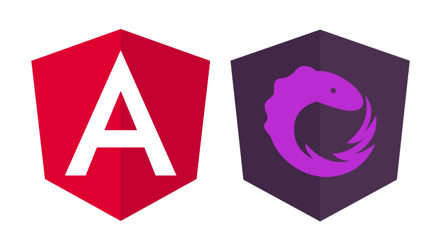

# NgRx (with NgRx Data) - The Complete Guide

June 2021

> 🔨 From udemy: [NgRx (with NgRx Data) - The Complete Guide - Vasco Cavalheiro / Angular University](https://www.udemy.com/course/ngrx-course/).

---

## To Run the Development Backend Server

We can start the sample application backend with the following command:

    `npm run server`

This is a small Node REST API server.

## To run the Development UI Server

To run the frontend part of our code, we will use the Angular CLI:

    `npm start`

The application is visible at port 4200: [http://localhost:4200](http://localhost:4200)

## Dependancies

## Useful links

- [ngrx-course](https://github.com/angular-university/ngrx-course)
